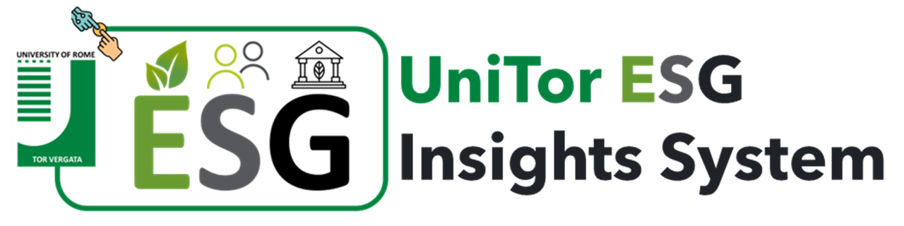
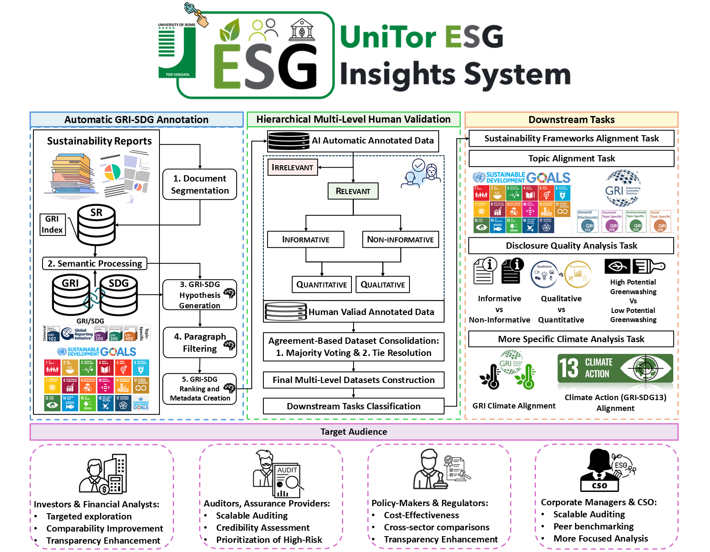

# UniTor ESG Insights System

Companion repository for the paper submitted at [CIKM 2026](https://cikm2026.diag.uniroma1.it/), Rome, ITALY. 

## Table of Contents
- [Overview](#overview)
- [Architecture](#architecture)
- [Tasks and Experimental Results](#tasks-and-experimental-results)
- [Workflow](#workflow)
- [Hugging Face Deployment](#hugging-face-deployment)
- [Demo Video](#demo-video)
- [Repository Structure](#repository-structure)
- [Citation](#citation)
- [License](#license)

## Overview
### An Interactive Human–AI Hierarchical Multi-Level System for Sustainability Report Paragraph-Level ESG Analysis 
An interactive human-in-the-loop system for hierarchical, multi-level analysis of sustainability report paragraphs, integrating AI-assisted workflows for PDF parsing, GRI–SDG framework relevance filtering, SDG/GRI topic alignment, disclosure quality assessment, and climate-related analysis.

## Architecture
The UniTor ESG Insight System follows a hierarchical, multi-stage architecture designed for fine-grained ESG analysis of sustainability reports. The system is structured as a pipeline that integrates automatic annotation, hierarchical human validation, and downstream analytical modules to support multiple stakeholder requirements.

The architecture is composed of four main layers:

### 1. Automatic GRI–SDG Annotation Layer  
This layer performs the initial transformation of raw sustainability report paragraphs into structured ESG-aligned data inspired by [1, 2]. It consists of five sequential steps:

1. Document segmentation  
2. Semantic preprocessing  
3. GRI–SDG hypothesis generation  
4. Paragraph filtering based on relevance  
5. GRI–SDG ranking and metadata construction  

This stage produces the initial weakly/heuristically labeled dataset used for further refinement.

#### References 

[1] Anaraki, S. A. M., Croce, D., & Basili, R. (2025). *Automatic GRI-SDG Annotation and LLM-Based Filtering for Sustainability Reports*. Proceedings of the Eleventh Italian Conference on Computational Linguistics (CLiC-it 2025), 775–784. 

[2] Anaraki, S. A. M., Croce, D., & Basili, R. (2025). *Unsupervised Sustainability Report Labeling based on the integration of the GRI and SDG standards*. Proceedings of the Fourth Workshop on NLP for Positive Impact (NLP4PI), 151–162.

---

### 2. Hierarchical Multi-Level Human Validation Layer  
This layer introduces expert validation to ensure annotation quality and consistency. It supports multi-level review of ESG labels and refines automatically generated annotations for dataset reliability in downstream tasks.

---

### 3. Downstream ESG Analytical Layer  
This layer performs structured ESG interpretation and classification using fine-tuned transformer models trained on validated datasets. It supports multiple analytical tasks, including:

- Sustainability framework alignment  
- Topic alignment (SDG and GRI topic classification)  
- Disclosure quality assessment 
- Climate-related sustainability analysis  

---

### 4. Target Audience Layer  
The system is designed to generate insights tailored for multiple stakeholder groups:

- Investors & Financial Analysts  
- Auditors & Assurance Providers  
- Policy Makers & Regulators  
- Corporate Managers & CSOs  

---

### Architecture Overview

<p align="center">
  
</p>

## Tasks and Experimental Results

All models are fine-tuned Transformer-based architectures and are dynamically loaded into the Gradio-based application via Hugging Face integration. The system evaluates multiple ESG-related classification and analysis tasks across paragraphs of sustainability reports.

---

### 1. Sustainability Framework Alignment (GRI & SDG Relevance)

This task identifies whether a paragraph is relevant to sustainability frameworks and aligns it with GRI and SDG standards.

- **[Model](https://huggingface.co/alirezamousio/SA_MODEL):** bert-base-cased  
- **Performance:** Accuracy 97.7% ± 1.4  
- **Dataset:** 1,273 samples (973 relevant, 300 irrelevant)

---

### 2. Topic Alignment

#### 2.1 SDG Topic Alignment (17 SDGs Multi-label Classification)
- **[Model](https://huggingface.co/alirezamousio/SDG_MODEL):** bert-base-cased  
- **Performance:** 86% ([OSDG](https://github.com/osdg-ai/osdg-data) benchmark)  
- **Dataset:** 29,353 multi-label samples  

#### 2.2 GRI Topic Alignment
- **[Model](https://huggingface.co/alirezamousio/GRITopics_MODEL):** bert-base-cased  
- **Performance:** Accuracy 78% ± 5.5  
- **Dataset:** 973 samples  
  - Economic: 122  
  - Environmental: 378  
  - General: 231  
  - Social: 242  

---

### 3. Disclosure Quality Analysis

#### 3.1 Informative vs Non-Informative (Vague) Detection
- **[Model](https://huggingface.co/alirezamousio/INFVague_MODEL):** bert-base-cased  
- **Performance:** Accuracy 87.2% ± 2.1  
- **Dataset:** 732 samples (629 informative, 103 vague)

#### 3.2 Qualitative vs Quantitative Disclosure Classification
- **[Model](https://huggingface.co/alirezamousio/QQ_MODEL):** bert-base-cased  
- **Performance:** Accuracy 92.1% ± 3.5  
- **Dataset:** 707 samples (589 qualitative, 118 quantitative)

#### 3.3 Greenwashing Risk Detection (High vs Low Potential)
- **[Model](https://huggingface.co/alirezamousio/HPGW_MODEL):** bert-base-cased  
- **Performance:** Accuracy 91.0% ± 3.5  
- **Dataset:** 542 samples (457 high-risk, 85 low-risk)

---

### 4. Climate-Related ESG Analysis

#### 4.1 Climate Relevance Classification
- **[Model](https://huggingface.co/alirezamousio/Climate_MODEL):** ClimateBERT (distilroberta-base-climate-f)  
- **Performance:** 93.3% ± 2.7 (internal) / 89% ([Climate Detection](https://huggingface.co/datasets/climatebert/climate_detection) benchmark)  
- **Dataset:** 1,768 samples (355 climate, 231 non-climate)

#### 4.2 GRI Climate Category Alignment
- **[Model](https://huggingface.co/alirezamousio/GRIClimate_MODEL):** ClimateBERT  
- **Performance:** Accuracy 80.5% ± 4.5  
- **Dataset:** 586 samples (multi-class GRI climate categories)

#### 4.3 SDG 13 (Climate Action) Alignment
- **[Model](https://huggingface.co/alirezamousio/ClimateActionSDG13_MODEL):** ClimateBERT (distilroberta-base-climate-f)  
- **Performance:** Accuracy 91.7%  
- **Dataset:** 888 samples (568 climate action, 320 non-climate action)

#### 4.4 Extended GRI-SDG13 Classification
- **[Model](https://huggingface.co/alirezamousio/GRISDG13_MODEL):** ClimateBERT  
- **Performance:** Accuracy 94.5%  
- **Dataset:** 888 samples  
  - GRI categories: General, Environmental, Economic  

---

### System Integration Note

All [trained models](https://huggingface.co/alirezamousio/models) are hosted on Hugging Face and are dynamically loaded into the Gradio interface to enable real-time ESG paragraph-level analysis across all tasks.

## Workflow

The UniTor ESG Insight System implements a Human-in-the-Loop interactive workflow that transforms raw sustainability report PDFs into structured, multi-level ESG insights. The system supports both fully automated processing and user-driven correction/refinement at every stage.

### Human-in-the-Loop Interactive Workflow Overview

<p align="center">
  
</p>

---

### 1. Data Ingestion and PDF Processing

Users begin by uploading PDFs of sustainability reports. The system automatically:

- Extracts text at the paragraph level
- Preserves document-page structure
- Converts extracted content into an intermediate CSV format

Users can:
- Preview extracted paragraphs per page (next/previous navigation)
- Download the CSV for quality inspection
- Optionally modify, merge, split, or remove paragraphs
- Alternatively, upload a manually prepared CSV as input (skipping PDF extraction)

This ensures flexibility between fully automated and user-curated datasets.

---

### 2. Sustainability Framework (GRI–SDG) Alignment

Once a clean paragraph dataset is available, the system performs:

- Classification of relevant vs non-relevant ESG content
- GRI–SDG alignment prediction
- Visualization of class distribution (relevant vs irrelevant)

Users can:
- Download annotated CSV outputs
- Validate and refine selected relevant samples
- Re-upload corrected datasets for improved downstream analysis

---

### 3. Topic Alignment: SDG & GRI Classification 

Filtered relevant paragraphs are passed to fine-grained topic models for:

- GRI topic classification
- SDG classification
  
The system provides:
- Interactive dashboards with filtering by SDG or GRI categories
- Table-based inspection of predictions
- CSV export for external validation

---

### 4. Disclosure Quality Analysis

The system analyzes *how ESG information is communicated*, not only what is reported. This includes:

- Informative vs non-informative (vague) classification  
- Qualitative vs quantitative disclosure detection  
- High vs low potential greenwashing estimation  

Users can:
- Run one or multiple quality tasks independently
- Interpret separate outputs per task (since models are independently trained)
- Download structured CSV files for each analysis
- Explore results via interactive dashboards

---

### 5. Climate-Focused ESG Analysis

The system provides specialized climate-related ESG analysis, including:

- Climate relevance detection  
- GRI climate category classification  
- SDG 13 (Climate Action) alignment    

Users can:
- Filter climate-related paragraphs
- Combine multiple climate tasks for comparative interpretation
- Visualize results through interactive dashboards
- Export climate-specific annotated datasets

---

### 6. Output and Exploration Layer

For each stage, the system provides:

- Downloadable CSV files
- Interactive dashboards with filtering and visualization
- Task-specific outputs (GRI, SDG, quality, climate)
- Re-upload capability for iterative refinement

This enables a cyclical workflow where users continuously refine data quality and analysis outcomes.

---

### Hugging Face Deployment

The [system](https://huggingface.co/spaces/alirezamousio/HMLPADSSSRA) is fully deployed via Hugging Face Spaces, allowing direct execution of the pipeline and interactive demonstration without local setup.

---

### Demo Video


## Repository Structure

```bash
UniTor ESG Insight System/
│
├── app.py
├── requirements.txt
├── README.md
│
├── configs/
│   ├── model_config.py
│   └── sdg_labels.py
│
├── models/
│   ├── classifier.py
│   ├── sdg_classifier.py
│   ├── model_loader.py
│   └── predictor.py
│
├── pdf_processing/
│   └── pdf_utils.py
│
├── ui/
│   ├── gradio_functions.py
│   ├── filters.py
│   ├── charts.py
│   ├── state.py
│   ├── theme.py
│   └── interface.py
│
└── assets/
    ├── logo.png
    ├── architecture.png
    ├── workflow.png
    │
    ├── sdg_icons/
    ├── gri_icons/
    ├── quality_icons/
    ├── climate_icons/
    │
    ├── example_reports/
    │   ├── sample_report_1.pdf
    │   └── sample_report_2.pdf
    │
    └── example_outputs/
        ├── extracted.csv
        ├── results.csv
        ├── chart_sdg.png
        └── chart_gri.png
```

## Citation
## License


